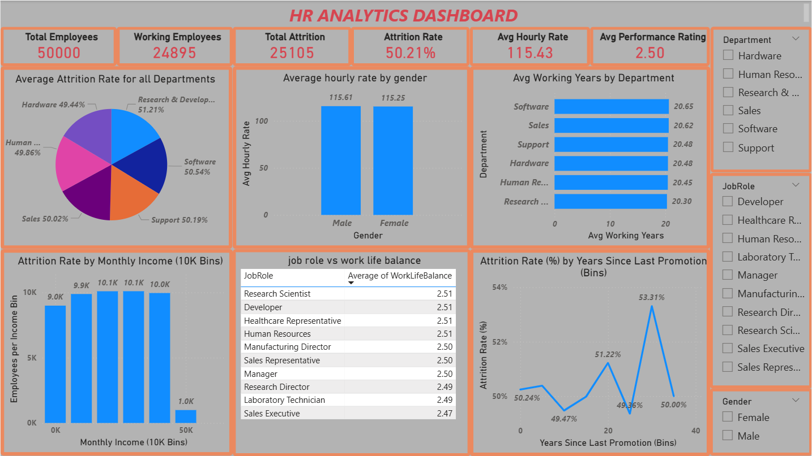
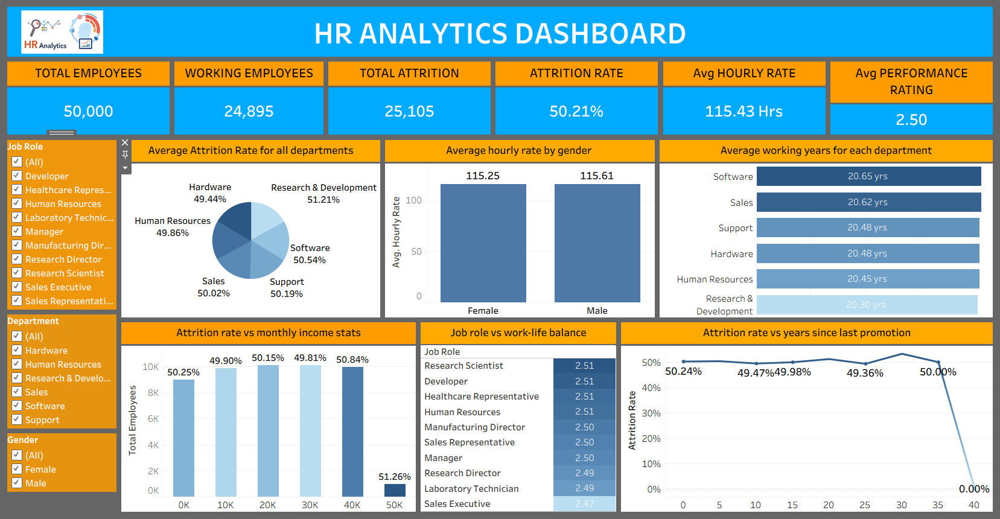

# HR Analytics Dashboard

## 📌 Problem Statement
Organizations struggle to understand employee attrition and its key drivers. This project analyzes HR data to identify patterns in attrition, salary distribution, and employee satisfaction.

---

## 🛠 Tools & Technologies
- SQL (MySQL)
- Power BI
- Tableau
- Excel

---

## 📊 Key Analysis Performed
- Employee Attrition Analysis
- Department-wise Attrition Trends
- Attrition vs Monthly Income
- Promotion Gap Analysis
- Work-Life Balance Impact

---

## 📈 Key Insights
- Overall attrition rate is around 50%
- Attrition is consistent across departments
- Employees with longer promotion gaps show slightly higher attrition
- Work-life balance plays a role in retention

---

## 📊 Dashboard Preview

---

## 📁 Project Structure

- `data/` → Dataset used
- `scripts/` → SQL queries
- `reports/` → Excel, Power BI & Tableau dashboards
- `dashboards/` → Dashboard screenshots

---

## 📁 Dataset

The dataset used in this project is large and not uploaded to GitHub.

🔗 [Download Dataset]([https://drive.google.com/drive/folders/1My_IT-j8OpfV9QIkm6IYYxgOt_d240a3?usp=sharing](https://drive.google.com/drive/folders/1My_IT-j8OpfV9Qlkn6IYYXgOt_d240a3?usp=sharing))

---

## 🚀 How to Use
1. Open dataset from `data/`
2. Run SQL queries from `scripts/`
3. Open dashboards in Power BI / Tableau

---

## 👤 Author
Sanjay Reddy Challa
